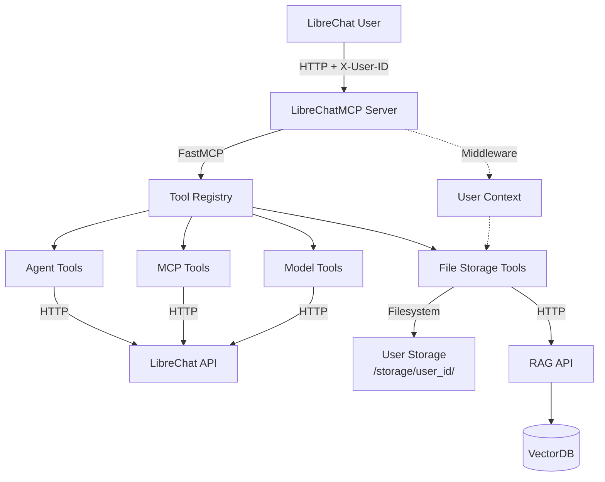

# LibreChatMCP - LibreChat Management Server

A comprehensive Model Context Protocol (MCP) server for managing LibreChat instances, providing tools for agent management, MCP server administration, model queries, and user-specific file storage.

## Features

### 🤖 Agent Management
- **Create & Configure Agents** - Build custom AI agents with specific instructions and capabilities
- **List & Query Agents** - Browse and retrieve agent configurations
- **Update Agents** - Modify existing agent settings
- **Delete Agents** - Remove agents when no longer needed
- **Categories & Tools** - Query available agent categories and tools

### 🔌 MCP Server Management
- **Server Info** - Get information about MCP server configurations
- **Server Status** - Check MCP server health and availability
- **Tool Discovery** - List available MCP tools across servers

### 🎯 Model Management
- **Model Listing** - Query available AI models across endpoints

### 📁 User File Storage
- **Isolated Storage** - Each user has private, isolated file storage
- **File Operations** - Upload, list, read, modify, and delete files
- **Markdown Notes** - Create formatted notes with auto `.md` extension
- **Semantic Search** - Search files by content using RAG API
- **Persistent Storage** - Files persist across pod restarts
- **Automatic Indexing** - Files indexed for semantic search

## Quick Start

### Local Development

```bash
# Install dependencies
pip install -r requirements.txt

# Set environment variables
export LIBRECHAT_API_BASE_URL="http://localhost:3080/api"
export LIBRECHAT_EMAIL="your-email@example.com"
export LIBRECHAT_PASSWORD="your-password"
export RAG_API_URL="http://localhost:8000"

# Run the server
python main.py
```

### Testing

```bash
# Run unit tests
pytest tests/test_file_storage.py -v

# Run integration tests (requires RAG API)
RAG_API_URL=http://localhost:8000 pytest tests/test_rag_integration.py -v -m integration

# Run OAuth integration tests (requires LibreChat credentials)
export TEST_LIBRECHAT_EMAIL='your-email@example.com'
export TEST_LIBRECHAT_PASSWORD='your-password'
pytest tests/test_oauth_integration.py::test_oauth_flow_docker -v

# Run OAuth tests in production
export PRODUCTION_HOST='https://chat.example.com'
pytest tests/test_oauth_integration.py::test_oauth_flow_production -v

# Run critical OAuth configuration test (prevents error redirects)
pytest tests/test_oauth_integration.py::test_oauth_configuration_prevents_error_redirect -v

# Or use the test runner script
./tests/run_oauth_tests.sh docker      # Test Docker environment
./tests/run_oauth_tests.sh production  # Test production environment
./tests/run_oauth_tests.sh health     # Quick health check (no credentials)
./tests/run_oauth_tests.sh config     # Validate OAuth config (CRITICAL - prevents error redirects)
./tests/run_oauth_tests.sh all        # Run all tests

# Run all tests
pytest tests/ -v
```

### Git Hooks

LibreChatMCP includes git hooks for automated quality checks. Hooks run automatically when you commit or push code.

#### Installation

Hooks are installed automatically when you run the root repository's installation script:

```bash
# From root repository
./scripts/install-git-hooks.sh
```

Or manually install hooks in this submodule:

```bash
cd LibreChatMCP
chmod +x .git/hooks/pre-commit .git/hooks/pre-push
```

#### Pre-commit Hook

The pre-commit hook runs fast tests before each commit:

- **Linting**: `ruff check` or `flake8`
- **Formatting**: `ruff format --check` or `black --check`
- **Type Checking**: `mypy` (if configured, non-blocking)
- **Unit Tests**: `pytest tests/ -v -m "not integration" --tb=short`
- **OAuth Config Validation**: `pytest tests/test_oauth_integration.py::test_oauth_configuration_prevents_error_redirect -v`

Run manually:
```bash
./scripts/run-fast-tests.sh
```

#### Pre-push Hook

The pre-push hook runs integration tests before pushing:

- **Integration Tests**: `pytest tests/ -v -m integration`
- **OAuth Integration Tests**: `pytest tests/test_oauth_integration.py -v` (requires credentials)
- **Docker Build Test**: Validates Dockerfile builds successfully
- **Dockerfile Lint**: `hadolint Dockerfile` (if available)

Run manually:
```bash
./scripts/run-integration-tests.sh
```

#### Bypass Options

To bypass hooks when needed:

```bash
# Skip pre-commit hook
git commit --no-verify

# Skip pre-push hook
git push --no-verify

# Skip hooks in CI/CD
export SKIP_HOOKS=true
```

### Deployment to Kubernetes

```bash
# Build and push Docker image
docker build -t ghcr.io/simonvanlaak/librechatmcp:latest .
docker push ghcr.io/simonvanlaak/librechatmcp:latest

# Deploy with Helm
cd ../../helm/librechat
helm upgrade --install librechat . \
  --set librechatmcp.storage.enabled=true \
  --set librechatmcp.ragApiUrl=http://librechat-rag-api:8000
```

## Available Tools

### Agent Management

| Tool | Description |
|------|-------------|
| `create_agent(...)` | Create a new AI agent with custom configuration |
| `list_agents(page, limit)` | List agents with pagination |
| `get_agent(agent_id)` | Get details of a specific agent |
| `update_agent(agent_id, ...)` | Update an existing agent's configuration |
| `delete_agent(agent_id)` | Delete an agent |
| `list_agent_categories()` | Get available agent categories |
| `list_agent_tools()` | List tools available for agents |

### MCP Server Management

| Tool | Description |
|------|-------------|
| `get_model_context_protocol_tools()` | List all MCP tools |
| `get_model_context_protocol_info()` | Get MCP server information |
| `get_model_context_protocol_status()` | Check MCP server status |

### Model Management

| Tool | Description |
|------|-------------|
| `get_models()` | List all available AI models |

### File Storage

| Tool | Description |
|------|-------------|
| `upload_file(filename, content)` | Upload a new file to storage |
| `create_note(title, content)` | Create a markdown note (auto-adds .md extension) |
| `list_files()` | List all user's files with metadata |
| `read_file(filename)` | Read file contents |
| `modify_file(filename, content)` | Update existing file |
| `delete_file(filename)` | Delete file from storage and index |
| `search_files(query, max_results)` | Semantic search across files |

## Architecture



## Configuration

### Environment Variables

**LibreChat Connection:**
- `LIBRECHAT_API_BASE_URL` - LibreChat API endpoint (default: `http://api:3080/api`)
- `LIBRECHAT_EMAIL` - Admin email for API authentication
- `LIBRECHAT_PASSWORD` - Admin password for API authentication

**File Storage:**
- `STORAGE_ROOT` - Root directory for file storage (default: `/storage`)
- `RAG_API_URL` - RAG API endpoint (default: `http://librechat-rag-api:8000`)
- `CHUNK_SIZE` - Text chunk size for embedding (default: `1500`)
- `CHUNK_OVERLAP` - Overlap between chunks (default: `100`)

**Server:**
- `HOST` - Server host (default: `0.0.0.0`)
- `PORT` - Server port (default: `8000`)

### LibreChat Integration

Add to `librechat.yaml`:

```yaml
mcpServers:
  librechat_mcp:
    type: streamable-http
    url: http://librechat_mcp:3002/mcp
    headers:
      X-User-ID: "{{LIBRECHAT_USER_ID}}"
    serverInstructions: |
      LibreChat Management Assistant with File Storage:
      - Create, manage, and query LibreChat agents and MCP servers
      - Personal file storage: upload, list, read, modify, delete files
      - Create markdown notes with create_note (auto-formats with title)
      - Semantic file search powered by RAG API
      - All files are private and isolated per user
    timeout: 600000
```

## Project Structure

```
LibreChatMCP/
├── main.py                       # FastMCP server entry point
├── requirements.txt              # Python dependencies
├── Dockerfile                    # Container image definition
├── setup.cfg                     # Pytest configuration
├── middleware/
│   ├── __init__.py
│   └── user_context.py          # Extract user_id from headers
├── tools/
│   ├── __init__.py
│   ├── agent.py                 # Agent management tools
│   ├── model_context_protocol.py # MCP server tools
│   ├── models.py                # Model query tools
│   ├── file_storage.py          # File storage operations
│   └── auth.py                  # LibreChat authentication
└── tests/
    ├── __init__.py
    ├── test_file_storage.py     # File storage unit tests
    └── test_rag_integration.py  # RAG API integration tests
```

## User Isolation (File Storage)

File storage implements strict user isolation:

- **Storage Path:** `/storage/{user_id}/{filename}`
- **File ID:** `user_{user_id}_{filename}` (used in vectordb)
- **Metadata Filtering:** All searches automatically filter by `user_id`
- **Header-Based Auth:** User identity from `X-User-ID` header (set by LibreChat)

### User Context Extraction

The server extracts user context from the `X-User-ID` HTTP header sent by LibreChat. This is implemented using:

1. **ASGI Middleware** (`middleware/user_context.py`): Intercepts HTTP requests and extracts the `X-User-ID` header
2. **Context Variables** (`contextvars`): Thread-safe storage for per-request user context
3. **File Storage Integration**: All file operations automatically use the current user context

**Implementation Details:**
- Uses Python's `contextvars` for thread-safe, per-request user context storage
- Middleware extracts `X-User-ID` header from incoming requests
- Template strings like `{{LIBRECHAT_USER_ID}}` are ignored (treated as no user context)
- This allows initialization to work without user context
- User context is automatically cleared after each request
- If user context is missing, file storage operations will raise a `RuntimeError`
- Initialization and other non-file-storage operations work fine without user context

**Note:** FastMCP doesn't expose its underlying ASGI app publicly, so the middleware is applied through a wrapper that attempts to access FastMCP's internal app. If the app cannot be accessed, the server falls back to running FastMCP directly (without middleware), which means user context extraction may not work. In this case, file storage operations will fail with authentication errors.

**Verification:**
- Check server logs for "Starting LibreChatMCP server with user context middleware" message
- If you see "WARNING: User context middleware not available", the fallback mode is active
- Test file operations from LibreChat UI - they should work if middleware is active

## Dependencies

- **fastmcp** - MCP server framework
- **requests** - HTTP client for LibreChat API
- **aiofiles** - Async file I/O operations
- **httpx** - Async HTTP client for RAG API
- **pytest** & **pytest-asyncio** - Testing framework

## Use Cases

### Agent Management
```
"Create an agent called 'Code Reviewer' that reviews Python code"
"List all available agents"
"Update the Code Reviewer agent to also check for security issues"
"Delete the old Test Agent"
```

### File Storage & Notes
```
"Create a note titled 'Project Ideas' with my brainstorming list"
"Upload my meeting_notes.txt file"
"Search my files for 'quarterly report'"
"List all my files"
"Read the Project_Ideas.md file"
```

### MCP Server Management
```
"What MCP servers are available?"
"Check the status of all MCP servers"
"List all tools available through MCP"
```

## GitHub Actions Secrets

This repository uses GitHub Actions for automated CI/CD. The following secrets must be configured in the repository settings (Settings → Secrets and variables → Actions):

### Required Secrets

- **`PARENT_REPO_TOKEN`** - Personal Access Token (PAT) with `repo` scope to trigger the parent repository (TheMaryAnne) workflow after successful image push. This token must have permissions to trigger `repository_dispatch` events in the parent repository.

### How to Generate the Token

1. Go to GitHub Settings → Developer settings → Personal access tokens → Tokens (classic)
2. Generate a new token with the `repo` scope
3. Add it as a secret named `PARENT_REPO_TOKEN` in this repository's secrets

### Automated Deployment Flow

When code is pushed to the `main` branch:
1. Tests run (if any)
2. Docker image is built and pushed to GitHub Container Registry
3. Parent repository (TheMaryAnne) is automatically triggered to update the submodule reference and deploy

## Contributing

This is part of the TheMaryAnne project's LibreChat deployment on Hetzner Cloud.

## License

See [LICENSE](../LICENSE) file in the project root.